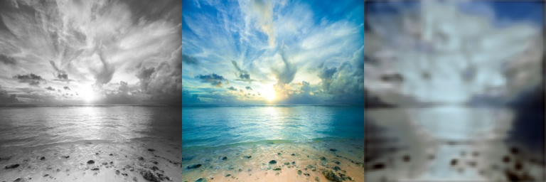

# Image Colorization  Updated Starter Code
The objective is to produce color images given grayscale input image. 

## Setup Instructions
Create a conda environment with pytorch, cuda.
e need a couple of more packages. Only tested with Ubuntu 18.
 

`$ conda install pytorch torchvision torchaudio cudatoolkit=11.3 -c pytorch`

`$ conda install -c conda-forge opencv yacs tqdm imagesize`

For systems without a dedicated gpu, you may use a CPU version of pytorch.
`$ conda install pytorch torchvision torchaudio cpuonly -c pytorch`

## Dataset
Use the zipfile provided as your dataset. 

 We randomly split the data set into 90% train and 10% validation. 
We removed the grayscale images as we believe they do not help training.
If you are interested in the final model, we included it in 'models/landscape_train'.
TODO see

 

## Code Guide
Baseline Model: A baseline model is available in `basic_model.py`. We use 256 x 256 size images for this problem.

 Data loader filled and added several more functionalities (e.g. different color models).
 

 Data loader filled and added several more functionalities (e.g. different color models).
 

Training and validation loop?

We included the training and validation loop in train.py.
 

Determine model performance using appropriate metric.

 We chose to use the simple L1 and L2 loss as metrics, which 
just measure the L1 and L2 reconstruction errors. Other possibilities include measuring 
perceptual realism (asking humans to rate the images), or measuring the percentage of predicted pixels colors
that are within a certain range of the correct pixel color. See [1].
 

Inference script? 

 We included an inference script. See below for instructions.
 

## Additional Remarks 
The network available in model.py is a very simple network. How would you improve the overall image quality for the above system?

 The main observation was that the RGB color model is not suitable
for this task, as it leads to very poor image quality overall. Although, it may be colorful,
it looks like a image, which was convolved with a Gaussian filter several times. Similar to
how a poorly trained Autoencoder would output images. For example, see the following grayscale, 
target and predicted image trained in the RGB color space.
 

We switched to a LAB color space, which
is much more suiting because it already contains a Lightness channel, which is very similar 
to a standard grayscale image channel. This means that we only need to predict the AB channels,
which reduced the problem immensely since it is a much less-dimensional problem (less ambiguous).
See the improvements in the following images.
 

Furthermore, the architecture itself is very small. Therefore, we included a network from [1], 
which consists of many more layers. Lastly, we can use a pretrained (on Imagenet Colorizaiton) 
version of this model, which enhances the performance even further.
 

 
We chose to cast this image colorization problem
as a simple regression problem. We know that this is not ideal as the literature points out that this
may lead to "washed out" or grayish images as we predict the mean of the color values over all images. With more time, 
it might make sense to rather predict a distribution over color values so as to handle the case of multiple
modes. See e.g. [1].
 

## Bonus

 Depending on how mood is defined, we could naivly darken or lighten the 
output image so as to model a depressing or happy mood. A more sophisticated idea might be to
predict a probability distribution over color values and take the annealed-mean of the distribution,
which we could control via a temperature paramter T (see [1]).
 

## Solution

We tried to train the basic_model with the RGB color model. As described before, this leads
to a very bad image quality. Switching to a LAB boosts performance by a lot as can be seen in the 
the following images.
 

Taking a larger
network is better and pretraining helps significantly, as can be seen in the following vibrant image.
 

To train, first choose which architecture and which color space you want. There is the 
basic model with RGB and LAB color space (choose base_config.yaml resp. base_config_LAB.yaml) 
and the larger architecture from [1] (choose larger_net.yaml). If you want to have it pretrained (on imagenet),
choose larger_net_pretrained.yaml. Please add your data set path and name in 
paths_catalog.py. This will be asked in the config under 
DATASETS.TRAIN and DATASETS.TEST. Then run
 

`$ python train.py --config-file "configs/larger_net_pretrained.yaml" `

By configuration, the validation images (gray, target, prediction) are saved in predictions.
 

To just run inference on a single grayscale image run for the basic model in LAB:
 

`$ python inference.py --img_path gray.jpg --model_to_load 
models/landscape_train/basic_LAB.pth `

Or for the larger model:
 

`$ python inference.py --img_path gray.jpg --model_to_load 
models/landscape_train/larger.pth --config configs/larger_net_pretrained.yaml`

Done. Please note that parts of the code have been inspired and adapted from 
maskrcnn_benchmark. Furthermore, note that the performance could be improved by means of 
data augmentation and mixed precision training and many more possible ways. Make sure that 
you set the correct paths.

 

[1] Zhang, Richard, Phillip Isola, and Alexei A. Efros. "Colorful image colorization." European conference on computer vision. Springer, Cham, 2016.
